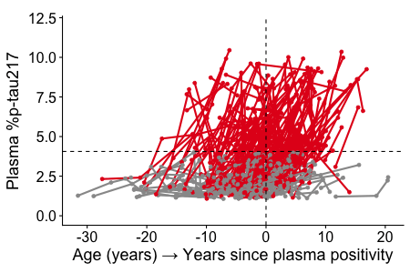

# Plasma p-tau217 clock

<!-- badges: start -->
<!-- badges: end -->


<p align="center">
  
</p>


> R code for analyzing plasma p-tau217 biomarker trajectories using TIRA (Temporal Integration of Rate Accumulation) to estimate individual biomarker clock time and predict symptomatic Alzheimer's disease onset.

---
## Overview

This repository contains R code for analyzing plasma p-tau217 biomarker trajectories using **TIRA** (Temporal Integration of Rate Accumulation), a computational approach for estimating individual biomarker clock time and predicting symptomatic Alzheimer's disease onset. TIRA models individual plasma p-tau217 rates of change using linear mixed-effects modeling with random slopes and intercepts. The rates of change are used in generalized additive models (GAM) with cubic splines to characterize non-linear relationships between the rates of change and plasma p-tau217 levels at the estimated midpoint of follow-up. The inverse of the modeled rate of change is integrated to derive the time between plasma %p-tau217 values.

This methodology creates "biomarker clocks" that estimate time since plasma p-tau217 positivity and predict risk of developing symptomatic Alzheimer disease. By integrating the inverse of modeled rates of change, TIRA derives temporal distances between different plasma biomarker values, enabling personalized risk assessment.

## Interactive Tool

🔗 **[Explore the plasma p-tau217 biomarker clocks](https://amyloid.shinyapps.io/plasma_ptau217_time/)**

Try our interactive Shiny application (Shinyapp) to visualize personalized biomarker clocks and survival curves.

## Clone this repository 

```
# Clone this repository
git clone https://github.com/WashUFluidBiomarkers/plasma_ptau217_time.git
```

## Key Components

### Assessing biomarker variance
- **`make_variance_plots.R`** - Creates diagnostic plots showing biomarker rate variance to guide range selection for optimal clock performance
- **`auto_variance.R`** - Helper functions for make_variance_plots.R


### Create TIRA models
- **`main_modular.R`** - Master script orchestrating the complete TIRA analysis workflow
- **`main_functions.R`** - Helper functions for the main TIRA code


### Visualization & Analysis Scripts
- **`make_plot_linear_symptoms.R`** - Creates scatter plots relating estimated biomarker onset age to actual symptom onset age with regression analysis
- **`make_raster_plot_FINAL.R`** - Creates raster plots showing individual participant trajectories aligned by estimated biomarker timing
- **`make_KM_figure.R`** - Generates Kaplan-Meier survival curves showing time to symptomatic Alzheimer's disease onset stratified by biomarker status
- **`make_survival_curve_figure.R`** - Generates survival analysis plots with left-, interval, and right-censoring
- **`make_AT_staging_figure.R`** - Produces AT (amyloid-tau) staging visualizations comparing biomarker timing across different disease stages


### Validation & Comparison Tools
- **`make_validation_conversion_age.R`** - Validates clock estimates against observed biomarker conversion ages in longitudinal data
- **`make_intermethod_cross_comparison.R`** - Compares TIRA and SILA method estimates for the same participants
- **`make_intramethod_cross_comparison.R`** - Cross-validates clock estimates between different cohorts using the same method


### Interactive Shiny Application
- **`app.R`** - Comprehensive Shiny application (Shinyapp) allowing users to explore biomarker clocks, input individual data, and visualize risk predictions

---

<p align="center">
  
  &nbsp;&nbsp;&nbsp;&nbsp;
  
</p> 

<p align="center">
  <strong>Washington University School of Medicine</strong><br>
  Knight Alzheimer Disease Research Center
</p>


<!--
---

## Citation

If you use this code in your research, please cite:

```
@article{your_citation_here,
  title={Predicting onset of symptomatic Alzheimer disease with a plasma p-tau217 clock},
  author={[Author names]},
  journal={[Journal name]},
  year={2025},
  doi={[DOI]}
}
```

-->
